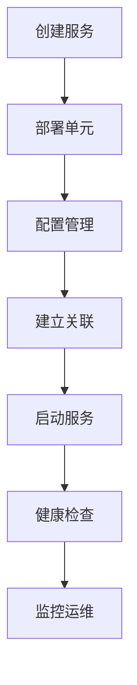

# yiqiu - 奕秋（部署平台）

<!-- vim-markdown-toc GFM -->

* [1. 项目概述](#1-项目概述)
    * [1.1 背景说明](#11-背景说明)
    * [1.2 项目定位](#12-项目定位)
    * [1.3 项目范围](#13-项目范围)
        * [核心功能范围](#核心功能范围)
        * [非功能特性](#非功能特性)
    * [1.4 技术栈](#14-技术栈)
        * [后端技术](#后端技术)
        * [部署环境](#部署环境)
* [2. 业务需求](#2-业务需求)
    * [2.1 服务标准化](#21-服务标准化)
    * [2.2 功能模块](#22-功能模块)
        * [2.2.1 服务管理模块](#221-服务管理模块)
        * [2.2.2 配置管理模块](#222-配置管理模块)
        * [2.2.3 关联关系模块](#223-关联关系模块)
    * [2.3 部署场景](#23-部署场景)
        * [场景1: 独立服务部署](#场景1-独立服务部署)
        * [场景2: 微服务集群部署](#场景2-微服务集群部署)
        * [场景3: 有状态服务部署](#场景3-有状态服务部署)
* [3. 系统架构](#3-系统架构)
    * [3.1 架构概览](#31-架构概览)
    * [3.2 分层设计](#32-分层设计)
        * [3.2.1 应用层 (Application)](#321-应用层-application)
        * [3.2.2 服务层 (Service)](#322-服务层-service)
        * [3.2.3 单元层 (Unit)](#323-单元层-unit)
    * [3.3 组件交互](#33-组件交互)
        * [3.3.1 控制流程](#331-控制流程)
        * [3.3.2 数据流向](#332-数据流向)
* [4. 核心模型设计](#4-核心模型设计)
    * [4.1 服务模型](#41-服务模型)
        * [YiqiuService (服务模型)](#yiqiuservice-服务模型)
        * [状态流转](#状态流转)
    * [4.2 关联关系模型(service 间依赖关系)](#42-关联关系模型service-间依赖关系)
        * [变更通知机制](#变更通知机制)
    * [4.3 联动关系模型(service 内联动)](#43-联动关系模型service-内联动)
    * [4.4 配置管理模型](#44-配置管理模型)
        * [配置层级](#配置层级)
        * [配置生效流程](#配置生效流程)
* [5. API接口规范](#5-api接口规范)
    * [5.1 基础API](#51-基础api)
        * [5.1.1 服务管理API](#511-服务管理api)
        * [5.1.2 单元管理API](#512-单元管理api)
    * [5.2 扩展API](#52-扩展api)
        * [5.2.1 健康检查API](#521-健康检查api)
* [6. 部署与运维](#6-部署与运维)
    * [6.1 环境要求](#61-环境要求)
        * [硬件要求](#硬件要求)
        * [软件要求](#软件要求)
    * [6.2 部署流程](#62-部署流程)
        * [快速部署](#快速部署)
    * [6.3 监控报警](#63-监控报警)
        * [监控指标](#监控指标)
        * [报警规则](#报警规则)
* [7. 开发指南](#7-开发指南)
    * [7.1 代码结构](#71-代码结构)
    * [7.2 开发规范](#72-开发规范)
        * [代码规范](#代码规范)
        * [测试要求](#测试要求)
* [8. 附录](#8-附录)
    * [8.1 术语表](#81-术语表)
    * [8.2 版本历史](#82-版本历史)

<!-- vim-markdown-toc -->

# 1. 项目概述

## 1.1 背景说明

**奕秋（yiqiu）** 是一个专注于物理机/虚拟机部署管理的 PaaS 平台，主要解决企业级服务在混合云环境下的标准化部署、运维管理问题。

## 1.2 项目定位

| 对比维度 | 传统部署 | 奕秋平台 |
|---------|---------|---------|
| **部署方式** | 手动部署 | 标准化模板化部署 |
| **运维模式** | 人工运维 | 自动化运维 + 可视化监控 |
| **故障处理** | 人工排查 | 自动故障检测与恢复 |
| **扩缩容** | 手动操作 | 一键智能扩缩容 |
| **配置管理** | 文件分散 | 集中配置管理与版本控制 |

## 1.3 项目范围

### 核心功能范围
- ✅ **服务部署标准化** - 基于Program包的统一部署规范
- ✅ **服务生命周期管理** - 完整的状态流转机制
- ✅ **服务拓扑管理** - 可视化服务依赖关系
- ✅ **自动化运维** - 监控、扩缩容、故障自愈
- ⚠️ **多环境支持** - 开发、测试、生产环境隔离
- 🔄 **资源调度优化** - 智能资源分配与负载均衡

### 非功能特性
- 🔒 **安全性** - 访问控制、审计日志
- 📊 **可观测性** - 全面的监控指标收集
- 🔄 **可扩展性** - 插件化架构设计

## 1.4 技术栈

### 后端技术
- **框架**: Butterfly
- **数据库**: MySQL + Peewee ORM
- **消息队列**: 集成RabbitMQ/Kafka
- **缓存**: Redis集群

### 部署环境
- **操作系统**: Linux (CentOS/Ubuntu)
- **容器技术**: Docker (可选)

# 2. 业务需求

## 2.1 服务标准化




通过服务标准化实现"您构建它，您运行它"（You build it, you run it）的目标，主要包含：

- **部署标准化**：统一的部署流程和配置管理
- **运维标准化**：自动化的监控、扩缩容和故障恢复
- **接口标准化**：统一的 API 和管理界面

## 2.2 功能模块

### 2.2.1 服务管理模块
- **服务创建** - 基于模板快速创建服务
- **服务部署** - 自动化部署流程
- **服务监控** - 实时状态监控
- **服务扩缩容** - 弹性资源调整

### 2.2.2 配置管理模块
- **配置模板** - 可复用的配置模板
- **配置版本** - 配置变更历史追溯
- **配置生效** - 配置热更新机制

### 2.2.3 关联关系模块
- **拓扑管理** - 服务依赖关系可视化
- **变更通知** - 关联关系变更通知
- **依赖解析** - 自动化依赖管理

## 2.3 部署场景

### 场景1: 独立服务部署
```
用户场景: 部署独立的Redis缓存服务
流程: 创建服务 → 配置参数 → 部署单元 → 启动服务
预期: 5分钟内完成标准化部署
```

### 场景2: 微服务集群部署  
```
用户场景: 部署包含多个微服务的应用集群
流程: 批量创建服务 → 建立关联关系 → 统一部署 → 健康检查
预期: 自动化完成整套环境部署
```

### 场景3: 有状态服务部署
```
用户场景: 部署MySQL主从集群
流程: 部署主节点 → 部署从节点 → 配置复制关系 → 健康检查
预期: 支持复杂拓扑结构的有状态服务
```

# 3. 系统架构

## 3.1 架构概览

```
┌─────────────────────────────────────────────────────────────┐
│                      平台管理层 (PaaS)                       │
│  ┌─────────────┐  ┌─────────────┐  ┌─────────────────────┐  │
│  │    API网关   │  │  调度引擎   │  │     配置中心        │  │
│  └─────────────┘  └─────────────┘  └─────────────────────┘  │
└─────────────────────────────────────────────────────────────┘
                               │
┌─────────────────────────────────────────────────────────────┐
│                     资源管理层 (IaaS)                        │
│  ┌─────────────┐  ┌─────────────┐  ┌─────────────────────┐  │
│  │  容器管理    │  │  网络管理    │  │     存储管理        │  │
│  └─────────────┘  └─────────────┘  └─────────────────────┘  │
└─────────────────────────────────────────────────────────────┘
                               │
┌─────────────────────────────────────────────────────────────┐
│                     基础设施层 (物理)                        │
│  ┌─────────────┐  ┌─────────────┐  ┌─────────────────────┐  │
│  │   服务器     │  │   网络设备   │  │     存储设备        │  │
│  └─────────────┘  └─────────────┘  └─────────────────────┘  │
└─────────────────────────────────────────────────────────────┘
```

## 3.2 分层设计

**设计原则**：数据模型应该基于服务模型进行分层设计，而不是基于具体的服务名称。

**错误示例分析**：
```markdown
# 不推荐的建表方式（基于服务名）
redis
proxy
shard
cluster
```

**正确的设计思路**：
- `redis` 和 `proxy` 应该属于同一层级的服务组件
- 数据模型应该抽象为：`Service`、`Component`、`Instance` 等通用概念
- 通过配置和元数据来描述具体的服务类型

### 3.2.1 应用层 (Application)
**职责**: 业务应用的整体管理
- 应用创建与删除
- 应用级别的配置管理

### 3.2.2 服务层 (Service)  
**职责**: 具体服务组件的管理
- 服务部署与启停
- 服务配置管理
- 服务扩缩容控制

### 3.2.3 单元层 (Unit)
**职责**: 服务实例的精细化管理
- 单元生命周期管理
- 单元状态监控
- 单元资源配置

## 3.3 组件交互

### 3.3.1 控制流程
```
用户请求 → API网关 → 业务逻辑处理 → 资源调度 → 执行器 → 返回结果
```

### 3.3.2 数据流向
```
配置变更 → 配置中心 → 服务实例 → 状态上报 → 监控系统
```

# 4. 核心模型设计

## 4.1 服务模型

### YiqiuService (服务模型)
```python
class YiqiuService:
    service_id: str           # 服务唯一标识
    program: str             # 程序包名称
    version: str             # 程序版本
    status: str              # 服务状态
    env_type: str            # 环境类型
    created_time: datetime   # 创建时间
    updated_time: datetime   # 更新时间
```

### 状态流转
```
none → deploying → running → stopped → error
          ↓           ↓         ↓        ↓
       allocated → deployed → installed → ready
```

## 4.2 关联关系模型(service 间依赖关系)
```
                    (依赖)
      requirer                 provider
    service_id(A) ---------> service_id(B)
    interface:XX             interface:XX
    name:Y1                  name:Y2
    -------------------------------
    B 服务变更时需要通知 A 服务变更
```

service 会与其他多个 service 之间有关联关系，通过关联关系名称加以区分。

即：建立关联关系的 interface 需要一样，但是 name 可以在各组件中自定义
```
+-----------+
| twemproxy | requirer (interface:memcache, name:cacheXX)
+-----+-----+
      |
      |
      |
+-----V-----+
| memcache  | provider (interface:memcache, name:cache)
+-----------+
```


如图所示，平台管理的关联关系包括 unit 粒度和 service 粒度。

> * unit 粒度：如 service A 依赖 server B 中所有 unit 的 ip port;
> * service 粒度：如 service A 依赖 service C 第三方服务（没有具体的 service）

将此块描述放到部署包中，依托平台达到当下游实例变更时，上游配置自动更新，以达到“You build it，you run it.”的目的

这里的上游自动更新会根据关联关系自动增加 / 删除变动的下游实例

```
unit 粒度主要就是 unit ip port 列表, 如依赖 etcd 的话，配置为 ["192.168.1.10:2379", "192.168.1.11:2379", "192.168.1.12:2379"]
```

### 变更通知机制
```python
class RelationChange:
    JOIN = "join"           # 关联建立
    BROKEN = "broken"       # 关联断开  
    CHANGE = "change"       # 关联变更
```

## 4.3 联动关系模型(service 内联动)

> * Redis 主从、MySQL 主从、MongoDB Replica Set
> * ZooKeeper、Etcd 的 peer 关系

> etcd
```
创建 etcd 集群时使用动态发现创建，后续的节点变更常规方式替换
```

## 4.4 配置管理模型

### 配置层级
```
默认配置 (Program级别) → 服务配置 (Service级别) → 实例配置 (Unit级别)
```

### 配置生效流程
```
配置变更 → 版本记录 → 下发配置 → 生效确认 → 状态更新
```

# 5. API接口规范

## 5.1 基础API

### 5.1.1 服务管理API
- `POST /api/service/deploy` - 部署服务
- `GET /api/service/{id}` - 查询服务详情
- `PUT /api/service/{id}/status` - 更新服务状态
- `DELETE /api/service/{id}` - 删除服务

### 5.1.2 单元管理API  
- `GET /api/unit/{id}` - 查询单元详情
- `PUT /api/unit/{id}/status` - 更新单元状态

## 5.2 扩展API

### 5.2.1 健康检查API
- `GET /api/health/service` - 服务健康状态
- `GET /api/health/relation` - 关联关系健康状态

# 6. 部署与运维

## 6.1 环境要求

### 硬件要求
- **CPU**: 4核以上
- **内存**: 8GB以上  
- **存储**: 100GB可用空间
- **网络**: 千兆网络连接

### 软件要求
- **Python**: 2.7
- **MySQL**: 5.7+
- **Redis**: 4.0+

## 6.2 部署流程

### 快速部署
```bash
# 1. 克隆代码
git clone https://github.com/meetbill/butterfly.git
cd butterfly

# 2. 安装依赖
pip install -r requirements.txt

# 3. 初始化数据库
python butterfly/handlers/yiqiu/model.py

# 4. 启动服务
python butterfly/main.py
```

## 6.3 监控报警

### 监控指标
- **服务可用性**: 服务状态、响应时间
- **资源使用**: CPU、内存、磁盘、网络
- **业务指标**: 请求量、错误率、吞吐量

### 报警规则
- **服务异常**: 服务状态变为error持续5分钟
- **资源告警**: CPU使用率超过80%持续10分钟
- **性能告警**: 平均响应时间超过阈值

# 7. 开发指南

## 7.1 代码结构

```
butterfly/handlers/yiqiu/
├── api/                    # API接口层
│   ├── service/           # 服务相关API
│   ├── unit/              # 单元相关API  
│   └── relation/          # 关联关系API
├── model/                 # 数据模型层
├── service/               # 业务逻辑层
└── util/                  # 工具类
```

## 7.2 开发规范

### 代码规范
中世纪1. **命名规范**: 使用下划线命名法
中世纪2. **注释要求**: 每个函数必须包含docstring
中世纪3. **错误处理**: 统一使用异常处理机制

### 测试要求
- **单元测试**: 核心功能必须包含单元测试
- **集成测试**: 主要业务流程需要集成测试
- **性能测试**: 高频接口需要性能压测

# 8. 附录

## 8.1 术语表

| 术语 | 解释 |
|------|------|
| **Application** | 应用，包含多个相关服务的业务单元 |
| **Service** | 服务，可独立部署的业务组件 |
| **Unit** | 单元，服务的具体运行实例 |
| **Program** | 程序包，服务的标准化部署包 |
| **Relation** | 关联，服务间的依赖关系 |

## 8.2 版本历史

| 版本 | 日期 | 主要变更 |
|------|------|----------|
| v1.0.0 | 2026-01-04 | 原型设计阶段 |
