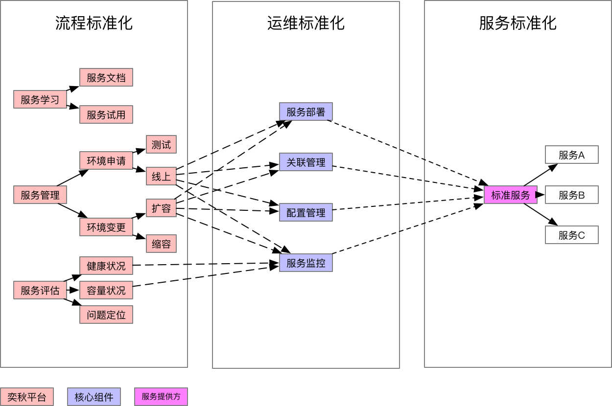
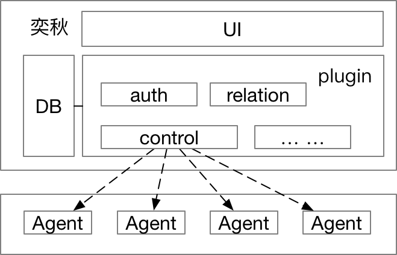
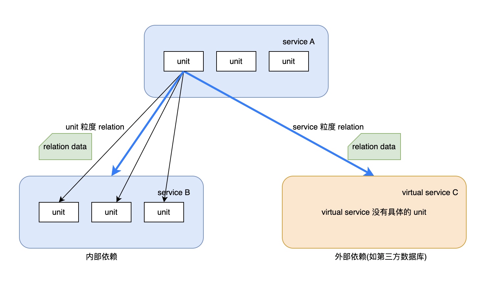

# yiqiu - 奕秋（部署平台）

<!-- vim-markdown-toc GFM -->

* [1. 项目概述](#1-项目概述)
    * [1.1 背景说明](#11-背景说明)
    * [1.2 项目定位](#12-项目定位)
    * [1.3 项目范围](#13-项目范围)
* [2. 技术背景](#2-技术背景)
    * [2.1 云计算基础](#21-云计算基础)
        * [云计算特征](#云计算特征)
        * [部署模式变迁](#部署模式变迁)
            * [应用部署运行模式变迁](#应用部署运行模式变迁)
* [3. 需求分析](#3-需求分析)
    * [3.1 核心需求](#31-核心需求)
        * [服务标准化](#服务标准化)
        * [有状态服务支持](#有状态服务支持)
* [4. 总体设计](#4-总体设计)
    * [4.1 系统架构](#41-系统架构)
    * [4.2 服务模型设计](#42-服务模型设计)
        * [4.2.1 分层模型](#421-分层模型)
        * [4.2.2 关联关系(service 间依赖关系)](#422-关联关系service-间依赖关系)
            * [4.2.2.1 关联关系接口](#4221-关联关系接口)
            * [4.2.2.2 关联关系角色](#4222-关联关系角色)
            * [4.2.2.3 关联关系名称](#4223-关联关系名称)
            * [4.2.2.4 关联关系粒度](#4224-关联关系粒度)
            * [4.2.2.5 关联关系建立](#4225-关联关系建立)
            * [4.2.2.3 关联关系触发](#4223-关联关系触发)
        * [4.2.3 linkage (service 内联动关系)](#423-linkage-service-内联动关系)
            * [4.2.3.1 etcd](#4231-etcd)
        * [4.2.4 unit 生命周期管理](#424-unit-生命周期管理)
    * [4.3 设计与折衷](#43-设计与折衷)
    * [4.4 潜在风险](#44-潜在风险)
* [5. 系统组件](#5-系统组件)
    * [5.1 yiqiu-agent](#51-yiqiu-agent)
    * [5.2 yiqiu-server](#52-yiqiu-server)
        * [5.2.1 Control 模块详细设计](#521-control-模块详细设计)
* [6. 实现案例](#6-实现案例)
    * [6.1 OpenStack 部署场景](#61-openstack-部署场景)
    * [6.2 数据模型设计](#62-数据模型设计)
* [7. 参考资料](#7-参考资料)
    * [7.1 相关项目](#71-相关项目)
    * [7.2 技术标准](#72-技术标准)
* [8. 参与开发](#8-参与开发)
    * [8.1 开发环境搭建](#81-开发环境搭建)
    * [8.2 贡献指南](#82-贡献指南)
    * [8.3 问题反馈](#83-问题反馈)

<!-- vim-markdown-toc -->

# 1. 项目概述

## 1.1 背景说明

奕秋（yiqiu）是一个专注于物理机/虚拟机部署管理的 PaaS 平台，主要解决企业级服务在物理环境下的标准化部署、运维管理问题。

**项目定位**：与 Kubernetes 形成互补关系，Kubernetes 专注于容器化应用的编排管理，而奕秋专注于物理/虚拟机环境下的服务部署管理。

**项目范围**：
- 支持物理服务器和虚拟机的统一管理
- 提供服务的标准化部署和生命周期管理
- 实现服务的自动化运维和故障自愈
- 支持有状态服务的集群化部署

**项目状态**：该项目主要面向技术研究和学习，为物理环境部署管理提供一种参考架构和实现方案。

## 1.2 项目定位

奕秋平台的核心价值在于为传统物理/虚拟机部署环境提供类似云原生的管理体验：

| 对比维度 | 传统部署 | 奕秋平台 |
|---------|---------|---------|
| 部署方式 | 手动部署 | 标准化部署 |
| 运维模式 | 人工运维 | 自动化运维 |
| 故障处理 | 人工排查 | 自动故障转移 |
| 扩缩容 | 手动操作 | 一键扩缩容 |

## 1.3 项目范围

本平台主要涵盖以下功能模块：
- 机器资源池管理
- 服务部署标准化
- 服务生命周期管理
- 服务拓扑和依赖管理
- 自动扩缩容和故障转移

# 2. 技术背景

## 2.1 云计算基础

### 云计算特征

云计算的五个基本特征：按需自助服务、广泛的网络接入、资源池化、快速弹性伸缩、可计量服务。

作为一个平台，虽然面向用户群体不同，但奕秋平台应该符合以下核心特征：
- **自助服务**：用户可以自主申请和管理资源
- **资源池化**：物理资源虚拟化为统一资源池
- **可计量服务**：支持资源使用量统计和计费

### 部署模式变迁
#### 应用部署运行模式变迁

应用部署模式经历了从物理机到虚拟机再到云原生的演变：

```
    物理机模式 ------> 虚拟机模式 ------> 云原生模式

 +--------------+  +-------+-------+  +-------+-------+
 |              |  |  VM   |   VM  |  | Docker| Docker|
 |  +---+ +---+ |  | +---+ | +---+ |  | +---+ | +---+ |
 |  |APP| |APP| |  | |APP| | |APP| |  | |APP| | |APP| |
 |  +---+ +---+ |  | +---+ | +---+ |  | +---+ | +---+ |
 |+------------+|  +-------+-------+  +-------+-------+
 ||  Physical  ||  +---------------+  +---------------+
 |+------------+|  |  OPENSTACK    |  |      K8s      |
 +--------------+  +---------------+  +---------------+
```

**云原生**概括为 4 个要点：DevOps + 持续交付 + 微服务 + 容器

- 采用开源堆栈（K8S + Docker）进行容器化
- 基于微服务架构提高灵活性和可维护性
- 借助敏捷方法、DevOps 支持持续迭代和运维自动化
- 利用云平台设施实现弹性伸缩、动态调度、优化资源利用率

# 3. 需求分析

## 3.1 核心需求

### 服务标准化



通过服务标准化实现"您构建它，您运行它"（You build it, you run it）的目标，主要包含：

- **部署标准化**：统一的部署流程和配置管理
- **运维标准化**：自动化的监控、扩缩容和故障恢复
- **接口标准化**：统一的 API 和管理界面

### 有状态服务支持

**无状态服务特点**：如 nginx 或 web server（不包含数据库），自身不需要保存数据，可以随意扩容或缩容。

**有状态服务挑战**：许多有状态程序需要集群式部署，具有以下特点：
- 节点间需要形成群组关系
- 每个节点需要唯一标识（如 Kafka BrokerId, Zookeeper myid）
- 集群内部成员间需要进行通信和协调

# 4. 总体设计

## 4.1 系统架构
```
   +---------------------+    +---------------------+
   |      platform1      |    |     platform2       |  平台功能层 (paas)
   +---------------------+    +---------------------+

--------------------------------------------------------------------------------

   +------------------------------------------------+
   | IAAS                                           |
   |   +-+  +-+  +-+  +-+  +-+  +-+  +-+  +-+  +-+  |
   |   +-+  +-+  +-+  +-+  +-+  +-+  +-+  +-+  +-+  | （实例）------ 资源平台层 (iaas)
   |   +--------+ +--------+ +--------+ +--------+  |
   |   |service1| |service2| |service3| |service*|  |
   |   +--------+ +--------+ +--------+ +--------+  |
   |__.__.__.__.__.__.__.__.__.__.__.__.__.__.__.__.|
   |   +-----------+  +-----------+  +-----------+  |
   |   | pool.bj01 |  | pool.bj02 |  | pool.nj0* |  | <---+ （资源池）
   |   +-----------+  +-----------+  +-----------+  |     |
   |                                                |     +--------- 机器管理层 (iaas)
   |   +-----------------------------------------+  |     |
   |   |                 Machine                 |  | <---+ （物理机）
   |   +-----------------------------------------+  |
   +------------------------------------------------+
```

整体架构分为三层：

- **平台功能层 (PaaS)**：面向用户的业务服务平台
- **资源平台层 (IaaS)**：资源虚拟化服务，管理 Container 容器的资源分配
- **机器管理层 (IaaS)**：管理物理机器关系，提供初始化、故障检测及监控报警功能

本设计主要实现 PaaS 层功能, 资源平台层及机器管理层在申请资源模块可替换



通过平台解决各服务运维的共性问题并统一服务运维方式，实现以下目标：

- **统一运维标准**：为不同服务提供标准化的部署、监控和运维流程
- **自动化管理**：实现服务的自动化扩缩容、故障检测和恢复

## 4.2 服务模型设计

### 4.2.1 分层模型

一个集群服务可能包含 N 个组件，组件间会存在依赖关系（通常构成有向无环图），每个组件包含多个实例。

从架构角度可以分为三层：

- **Application 层**：服务集群的顶层分组（Application 由一个或多个相互关联的 Service 构成的集群，作为一个整体对外提供服务）
- **Service 层**：具体的服务组件（Service 由若干同质 Unit 组成，代表了一组被独立运维的服务进程）
- **Unit 层**：服务组件的实际运行实例（Unit 代表了一个具体的服务进程，部署在某个 Container 上对外提供服务）

### 4.2.2 关联关系(service 间依赖关系)
```
一般情况下，对集群中服务的配置文件的变更主要涉及两类

> * 服务本身的配置，如 redis 是否开持久化，持久化的方式，maxmemory 的大小等等
> * 服务依赖某个下游，如果下游有实例变动，则需要更新配置文件中下游的访问地址
```
关联关系即服务上下游的依赖关系

服务提供者所关心的关联关系只包含哪些上游与哪些下游 service 之间存在关联，

例如 Service A 的下游是 Service B，至于这些关联是否会具体反映在配置文件中还是存在于 zookeeper（etcd 等） 上则是具体应用相关的逻辑。

关联标准化就是希望能够以一种与具体服务无关的方式，来对服务间的关联关系进行抽象，进而对关联关系进行显示的管理。

#### 4.2.2.1 关联关系接口

只有当部署在 service 上的 Program 包含相同关联关系接口，才能表示有关联。

#### 4.2.2.2 关联关系角色

关联关系角色包括 provider，requirer 两种

> * provider 表示关联关系信息提供者
> * requirer 表示关联关系需求者

```
                    (依赖)
      requirer                 provider
    service_id(A) ---------> service_id(B)
    interface:XX             interface:XX
    name:Y1                  name:Y2
    -------------------------------
    B 服务变更时需要通知 A 服务变更
```

#### 4.2.2.3 关联关系名称

service 会与其他多个 service 之间有关联关系，通过关联关系名称加以区分。

即：建立关联关系的 interface 需要一样，但是 name 可以在各组件中自定义
```
+-----------+
| twemproxy | requirer (interface:memcache, name:cacheXX)
+-----+-----+
      |
      |
      |
+-----V-----+
| memcache  | provider (interface:memcache, name:cache)
+-----------+
```

#### 4.2.2.4 关联关系粒度


如图所示，平台管理的关联关系包括 unit 粒度和 service 粒度。

> * unit 粒度：如 service A 依赖 server B 中所有 unit 的 ip port;
> * service 粒度：如 service A 依赖 service C 第三方服务（没有具体的 service）

将此块描述放到部署包中，依托平台达到当下游实例变更时，上游配置自动更新，以达到“You build it，you run it.”的目的

这里的上游自动更新会根据关联关系自动增加 / 删除变动的下游实例

#### 4.2.2.5 关联关系建立

两个 service 之间记录一条边

serviceA -----> serviceB
```
serviceB 需要指定是是 service 粒度还是 unit 粒度
若关联关系中 serviceB 是 service 粒度，则创建 serviceB unit 时不会触发 serviceA 变更
若关联关系中 serviceB 是 unit 粒度，则创建 serviceB unit 时，会通知 serviceA 变更
```

#### 4.2.2.3 关联关系触发

> * ralation-join: 第一次加入关联，Unit 初始化这条边相关的信息，并进行注册（平台会通知对端所有 Unit relation-unit-change）
> * ralation-broken: 关联关系被删除，Unit 清理该关联相关的数据
> * relation-change: 边上对端某个 unit 状态有更新（需要执行 add/update/delete）

### 4.2.3 linkage (service 内联动关系)

> * Redis 主从、MySQL 主从、MongoDB Replica Set
> * ZooKeeper、Etcd 的 peer 关系

#### 4.2.3.1 etcd

基于动态发现启动 etcd 集群
```
创建 etcd 集群时使用动态发现创建，后续的节点变更常规方式替换
```

### 4.2.4 unit 生命周期管理

**核心功能**：服务的全生命周期管理，包括部署、配置、监控等。

**实例状态机**：
```
+---------+  +---------+  +--------+  +---------+  +-----+  +-------+
|  none   |—>|allocated|—>|deployed|—>|installed|—>|ready|->|running|
+---+-----+  +----+----+  +----+---+  +----+----+  +--+--+  +-------+
    |             |            |           |          |
    |             |            |           |          |
    |             |            |           |          |
    |             |            |           |          |     +-------+
    +-------------+------------+-----------+----------+-----> error |
                                                            +-------+
```

**状态流转说明**：
1. `none → allocated`：申请 Container 资源
2. `allocated → deployed`：拉取 Program 包
3. `deployed → installed`：环境安装、配置变更、启动
4. `installed → ready`：认证变更、关联关系更新
5. `ready → running`：进入正常运行状态

**管理对象**：
- `program`：服务镜像标准化定义
- `relation`：服务间拓扑关系管理
- `config`：服务配置管理

## 4.3 设计与折衷
## 4.4 潜在风险
假设现在有两个关联的 service，各有 20 个 unit, 如果 relation 是 unit 级别，则可能会出现两 service 同时添加 unit 的并发问题，所以建议使用 service 级别 relation

# 5. 系统组件

## 5.1 yiqiu-agent

**核心功能**：管理程序部署和服务标准化的代理组件。

**主要职责**：
- 部署和管理 program（服务标准化抽象）
- 支持物理部署环境的特殊需求

**部署要求**：
- 必须使用绝对路径启动 yiqiu-agent
- 部署路径采用 `服务_port` 格式，支持同一服务的多实例部署
- 支持服务间的依赖关系管理

**GitHub 仓库**：[yiqiu-agent](https://github.com/meetbill/yiqiu-agent)

## 5.2 yiqiu-server

### 5.2.1 Control 模块详细设计

**架构概览**：
```
+--------------------------------------------------------+
| +---------------------------------------+              |
| | service_deploy                        |              |
| +-------+-------------------------------+              |
|         |                                              |
|         | 1                                            |
| +-------V-------------------------------+              |
| | +xingqiao_plugin+  +----------------+ |              | yiqiu-server
| | |unit_deploy    |  |command_from_mq | | Control 模块 |
| | |unit_command   |  |                | |              |
| | +-------------- +  +--/-------------+ |              |
| +-------|------------/--------|---------+              |
|         |          /          |                        |
|         | 2      / 3          | 4                      |
|         |      /              |                        |
|  +------V----V--+             |                        |
|  |     mq       |             |                        |
|  +--------------+             |                        |
+-------------------------------|------------------------+
                                |
                                |
                                |
                                V
+--------------------------------------------------------+
|  +---------+  +---------+  +---------+  +---------+    |
|  |  agent  |  |  agent  |  |  agent  |  |  agent  |    | yiqiu-agent
|  +---------+  +---------+  +---------+  +---------+    |
+--------------------------------------------------------+
```

**组件说明**：
- **unit_deploy**：管理单个实例的部署流程（Butterfly 星桥插件）
- **unit_command**：向 agent 发送命令的插件，支持批量操作
- **command_from_mq**：实际执行命令的 Handler

**部署流程**：
```
unit_deploy
    |
    +---------------------/yiqiu/command_from_mq install（部署）
    |
    +---------------------/yiqiu/command_from_mq config-changed（配置变更）
    |
    +---------------------/yiqiu/command_from_mq start（启动）
    |
    +---------------------/yiqiu/command_from_mq relation-changed（关联关系变更）
```

**命令操作**：
```
unit_command
    |
    +---------------------/yiqiu/command_from_mq command
    |
    +---------------------/yiqiu/command_from_mq command
    |
    +---------------------...
```
如上图，unit_deploy 和 unit_command 皆为 butterfly〖星桥〗插件

> unit_deploy 重点是管理一个实例的部署流程，实际命令都是 command_from_mq handler 进行执行
```
unit_deploy
    |
    +---------------------/yiqiu/command_from_mq install（部署）
    |
    +---------------------/yiqiu/command_from_mq config-changed（配置变更）
    |
    +---------------------/yiqiu/command_from_mq start（启动）
    |
    +---------------------/yiqiu/command_from_mq relation-changed（关联上下游关系）
```
> unit_command 重点是给 agent 发送命令，可对多个实例进行操作
```
unit_command
    |
    +---------------------/yiqiu/command_from_mq command
    |
    +---------------------/yiqiu/command_from_mq command
    |
    +---------------------...
```
# 6. 实现案例

## 6.1 OpenStack 部署场景

以 OpenStack 部署场景为例，说明如何使用奕秋平台进行大规模服务部署：

**场景背景**：OpenStack 需要部署在几百台物理机器上，管理对象为 OpenStack 的计算服务。

**部署流程**：

1. **服务创建**：在服务平台层创建服务
   - 在资源池中创建控制节点服务和计算节点服务
   - 为每个服务配置资源套餐和 Program 包

2. **实例添加**：服务平台向资源平台发起实例添加请求
   - 资源平台根据服务配置在资源池中分配资源
   - 创建相应的容器实例

3. **拓扑配置**：Program 包中预定义服务拓扑关系
   - 新实例根据拓扑描述自动配置上下游关系
   - 实现配置的动态更新和同步

## 6.2 数据模型设计

**设计原则**：数据模型应该基于服务模型进行分层设计，而不是基于具体的服务名称。

**错误示例分析**：
```markdown
# 不推荐的建表方式（基于服务名）
redis
proxy
shard
cluster
```

**正确的设计思路**：
- `redis` 和 `proxy` 应该属于同一层级的服务组件
- 数据模型应该抽象为：`Service`、`Component`、`Instance` 等通用概念
- 通过配置和元数据来描述具体的服务类型

**数据模型分层**：
- **基础设施层**：机器、资源池、容器等硬件资源管理
- **服务定义层**：服务模板、Program 包、配置模板等
- **运行实例层**：实际运行的 Service、Unit 实例

# 7. 参考资料

## 7.1 相关项目

- [yiqiu-agent](https://github.com/meetbill/yiqiu-agent)：奕秋平台的代理组件
- [Butterfly 框架](https://github.com/meetbill/butterfly)：底层服务框架
- [OpenStack](https://www.openstack.org/)：开源云计算平台

## 7.2 技术标准

- 云计算架构标准（NIST SP 500-292）
- 微服务架构最佳实践
- 容器编排技术规范

# 8. 参与开发

## 8.1 开发环境搭建

```bash
# 克隆项目
git clone https://github.com/meetbill/butterfly.git
cd butterfly

# 安装依赖
pip install -r requirements.txt

# 启动服务
python butterfly/main.py
```

## 8.2 贡献指南

1. Fork 项目仓库
2. 创建功能分支
3. 提交代码变更
4. 创建 Pull Request
5. 等待代码审查

## 8.3 问题反馈

- 通过 GitHub Issues 提交问题
- 提供详细的复现步骤和环境信息
- 附上相关的日志和错误信息
